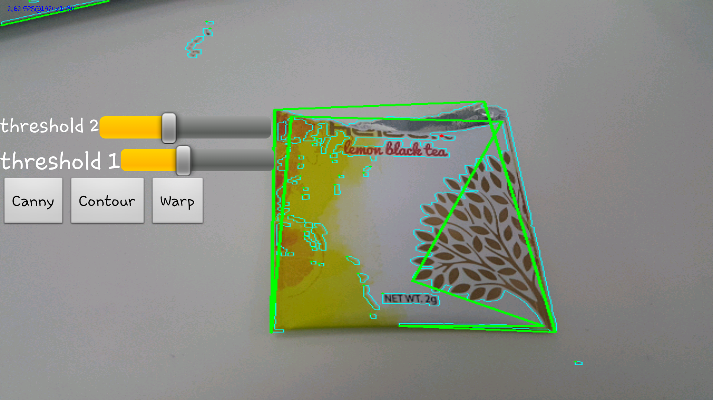
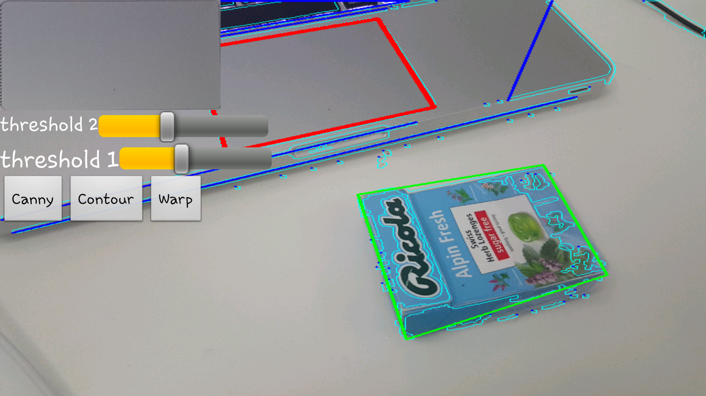
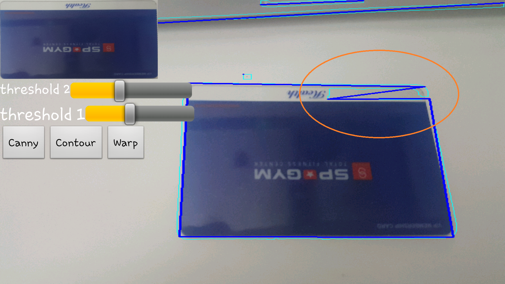

findingNemo
====

명함 인식 프로젝트 
사정상 소스는 올리지 못하지만 제작 과정을 공유합니다. 
(만드는 모든 과정을 찍으면서 한게 아니라 중간중간 빠진게 많고, 스크린샷도 시간을 뛰어넘어서 사용됩니다.)

 

 
가장 처음 만든 버전, 그냥 남들 하는 방식대로 따라했습니다. 
Canny로 이진 영상을 만들고, 외곽선을 찾아서 가장 큰 영역을 찾는게 끝. 
사진에서 양옆으로 여백이 나오는건, contour 그대로 출력하지 않고 bouding rect를 출력해서 그렇습니다.

 
 
 
 
근데 환경이 조금만 바뀌어도 노답상황이 발생합니다. 
세번째 사진의 경우 가장 큰 영역을 찾으라고 했는데 왜 저렇게 찾는지 이해조차 되지 않았습니다.

 
 
 
 
초인이 아닌이상 저 화면 하나만 가지고 뭐가 문제인지 알수가 없으니,
컴퓨터가 지금 무슨 생각을 하고 있는지 나도 볼 수 있는 디버그 인터페이스를 만들기로 합니다. 
첫번째 사진은 canny의 결과 화면, 두번째 화면은 canny로부터 계산된 화면입니다. 
초록색이 후보들, 파란색은 검출된 선, 하늘색은 외곽선입니다. 
보시면 알겠지만 뭐가 잘 안됩니다. 
 
잘 안된 상태로 끝낼수는 없으니까 좀더 최적화해보기로 합니다. 
일단 우리가 필요한건 사각형뿐이기때문에 꼭지점이 4개인것만 남기고 모두 버립니다.

 
 
꼭지점 4개를 찾기 위해선 먼저 외곽선을 단순화시킬 필요가 있습니다. 그렇지 않으면 실제 외곽선 자체는 꼭지점이 무수히 많은 상태이기 때문에 사각형으로 검색하면 노이즈만 잔뜩 걸립니다. 
외곽선을 단순화시킨 결과물입니다. 하늘색이 외곽선, 빨간색이 단순화 된 결과.

 
 
근데 이런놈도 꼭지점이 4개라 사각형이라고 잡아버립니다. 
이 문제에 대헛 첫번째로 시도했던 해결법은 너무 작은 사각형은 노이즈로 취급하고 무시하는것이었습니다. 

 
 
크기로 한번 걸렀더니 아까처럼 작은 노이즈가 잡히는 일은 없지만 때로는 이런 케이스도 생깁니다. 
그래서 아예 2개의 점이 가까운곳에 붙어있는경우도 제외시켜버립니다. 

 
 
 
이제 깔끔하게 잘 잡힙니다. 멋있으라고 각 4개의 꼭지점에 점도 찍어봤습니다.

 
 
최종 목표는 발견한 사각형에 투영 변환도 수행해야 하므로, 각 꼭지점이 무슨 꼭지점인지도 알아야 합니다. 
그래서 left top, left bottom, right ~ 이런 꼭지점들을 찾아냅니다. 이건 매우 쉽습니다.
여기까지 했을 때는 이제 다 만든 줄 알았습니다... 

 
 
 
그동안은 테스트를 밝은 조명 아래 검은색 책상, 밝은색 오브젝트로 테스트했는데, 환경을 바꾸자마자 인식률이 엄청나게 떨어집니다.
두번째 사진에서 주황색 동그라미 부분 처럼 실제로는 경계선인데 경계를 못찾아버리는 사태가 발생합니다. 
당연히 임계값을 조정도 해보았지만 저걸 찾을 수 있을 정도로 내리면 노이즈가 너무 많아 결국 네모를 못찾게되는 사태가 발생합니다. 

 
 
그동안 그레이 영상(싱글 채널)에 대해서 canny를 수행했는데 이렇게 하면 3채널에서 1채널로 내려오면서 너무 많은 정보가 손실된다고 판단했습니다. 
주황색 어두운 부분과 하얀색 어두운 부분은 완전 다른 영역인데, 그레이 영상으로 처리하면 그냥 똑같이 어두컴컴한 부분으로 인식되어 위에 주황색 원과 같은 결과가 나오는 것입니다. 
그래서 원본 영상의 RGB 각 채널에 대해 각각 canny를 수행하고 그걸 다시 1채널 영상으로 합칩니다. 
훨씬 선명한 외곽선이 생성됩니다.

 
 
개꿀 
위의 작업에서 색상을 제거하고, 0~255 싱글 채널 영상이던걸 그냥 바이너리 채널로 변경했습니다.

 
 
아까 사진과, 새 방법의 비교 

 
 
암튼 아까보다 배경이 어떻든 훨씬 잘잡습니다. 
하지만 문제는 여전히 있습니다.

 
 
꽃무니가 그려진 곳에 올려진 카드입니다. 외곽선 자체는 상당히 잘잡혔습니다. 
근데 너무 잘잡혀서 이러면 카드를 인식을 못합니다.

 
 
 
이런 문제도 있었습니다. 가끔 외곽선이 끊어집니다. 
그 결과 꼭지점이 노이즈에 이어지고, 4각형이 아니라 5각형이 되어서 인식이 안되는 문제가 있습니다.

 
 
그래서 선 검출을 이용해보고자 하였습니다. 외곽선 영상에서 선만 검출하여 그걸 기반으로 사각형을 찾자는건데,
사진만 보면 잘 되는것처럼 보입니다만, 엄청나게 안됩니다. 
뭣보다 오브젝트가 많은곳을 띄우면 엄청나게 느려집니다. (사용이 불가능할 정도로) 
결국 이 방법은 포기합니다.

 
 
추후에 선이 끊어지는 방법은 해결하였습니다. 끊어진 선을 이어붙인는 방법은 아니고, 선을 단순화시킬 때 파라미터를 조정하여 너무 가까운곳에다 이어붙이는것은 스킵하도록 조정하였더니 훨씬 나아졌습니다. 
근본적으로 해결된 것은 아니며, 가끔가다 발생하지만 사용이 불가능할정도는 아니라고 판단됩니다. 
 
꽃무니 배경에 올려놓는것은 미해결인 상태로 그냥 사용자에게 단색 배경의 책상에 올려놓아달라고 부탁할 생각입니다. 
당장은 방법이 떠오르지는 않습니다. 

 
 
이것이 일단 지금까지의 완성된 모습입니다. 아직 많은 케이스에서 정상적으로 동작하지 않지만 그래도 인식은 되긴 됩니다. 
사진 왼쪽 상단의 이미지가 최종 결과물입니다.

  
* 추후에 꼼수로 꽃무니 배경같은거 어느정도 커버되게 수정함
* 명함이 있을법한 자리에서만 외곽선을 따고, 나머지 영역은 그냥 외곽선 계산조차 안하는 방법을 사용해서 속도도 올리고 인식률도 올렸습니다.
